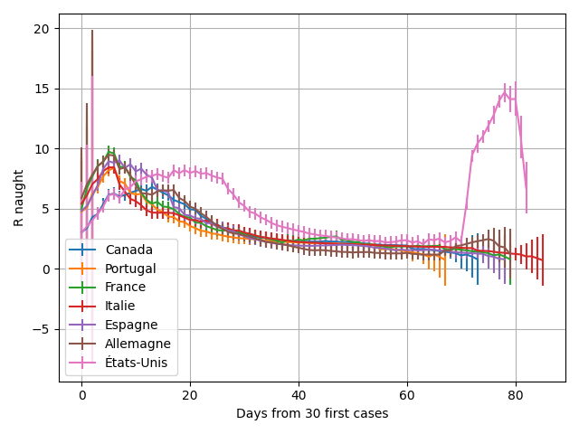
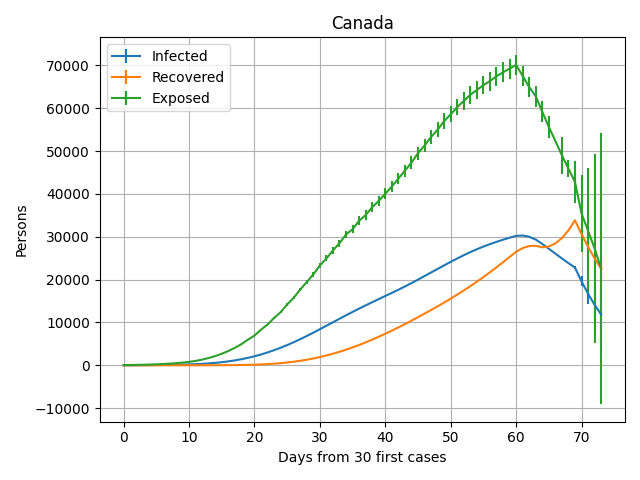
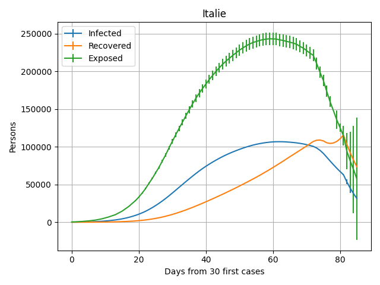

# Derivation of R0(t) of many countries with SEIR model and the Unscented Kalman Filter.

Inspired by Viktor Kärnstrand's work on _Medium_: https://towardsdatascience.com/estimating-the-effect-of-social-distancing-in-sweden-c6c1e606c8f9.

Derived R0 with french country names:

We observed the effect of increasing the measurement rate with the peak for all country between 0 and 20 days. Afterwards, the drop in transmission rate below the 5.7 days in recent literature is due to the confinement.

I, E and R populations derived for Canada and Italy with error margins of 3 standard deviations.

All examples have predictions for 5 days, which explained the rise in uncertainty in the last few days. All curves have been smoothed with a window of 10 days for plots and UKF (to stabilize the algorithm). Also, all UKF parameters have been fine-tune by hand.

Last update May 11th 2020.
